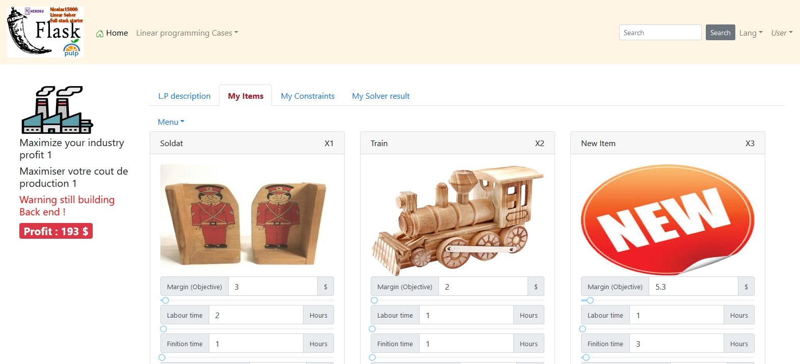
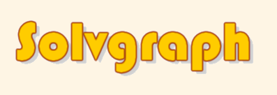

# Vue.js + Python Flask data science and Pulp linear solver web app starter



## Demo 

https://vue-python-starter.herokuapp.com/

<a href="https://heroku.com/deploy">
  
</a>

## Desc
This is a new 2020 Vue.js + Python Flask Backend Starter for real world mathematical linear optimizations and various data science apps . <br><br>

You can deploy it automatically to heroku by pushing only one simple button, no need to set up anything.
Takes full advantage of back end and front end hot reloading .

## Full Commercial multilingual version : SolvGraph
 <br>

<b>Graphically Optimize your industrials profits, your portfolios or your blends, using Solvgraph, an app plugged to the pulp and/or gurobi linear solvers. Portfolio management, healthcare, transport,  and much more coming , even binPacking ... </b><br>

Using graphicals linear templates makes it easy and cool to manage your factory production!<br>

Follow The full commercial version developpement there (Often updated) : https://solvgraph.herokuapp.com/ 


## Status
In dev, started 08-05-2020

## Latests news
10-15-2020 : All Code including the login-register code from Orange Petal, 
the India based developper, is currently mooved to the SOLVGRAPH private commercial depot . 
What's available there is just the basical front end-back end system ... For free ..

10-05-2020 : Added Multilanguage support in 3 hours using this vue.js module : https://www.npmjs.com/package/vue-translate-plugin 

09-28-2020 , The commercial version is available there :  https://solvgraph.herokuapp.com/ ,Please allow from 2 months to 2 years of developpement for a really nice app... Devs steps are adding a great flask middleware, IP and SESSIONS controlled DEMO limited times, making it easy and good looking, adding MonGoDb, and users sessions , Cruds, drag and drop, Google Login, multiples regressions cases , Multiple languages, and way much more . I'm looking to collab with 1 or more high level linear solver Dev too, please call.

09-23-2020 Set the Python Pulp Lowbounds and Upbounds after the initialization : https://stackoverflow.com/questions/7728313/python-pulp-using-with-matrices -> add it to the app

09-18-2020 : Next dev steps : Any item or constraint change will call the Dr Mitchell pulp linear solver in realtime with a realtime nice display (Using a small debounce) + Images uploading of course and items crud , yahoo ! 

09-10-2020 : This project is now called SolvGraph, and hosted on another private depot , I will provide a link in the next days for app testing also available on my website : www.applicationsH.club.

08-25-2020 : I will also add Gurobi. The back end currently looks ugly, but I will create a convert function, who will convert the front end json data to the well known list( decisions variables ) and dictionnaries ( constraints etc ...) needed by pulp <br>

08-23-2020 : Building the fully parametrable LP builder is way harder than I thought ! So , I will first produce 8 statics commons linear programs examples (Fuel Blends, Productions...), and limit the dynamic L.P builder to 1 component, untill it works ! The dynamic L.P builder needs a hard data engineering process including dynamically named variables, eventually using (exec()) ,etc ...<br><br>
08-22-2020 :  Currently studying how to make the food cost minimizer all dynamic and manageable from the front end, it is hard. It is the pulp_minimize_cost_1 function in app.py. N constraints or ingredients should be added from the front end... The  linear solver back end has to "understand it " automatically, it is the main difficulty of this linear solver starter.


## Others languages :

这是我针对数据科学应用程序和现实世界中的数学线性优化设计的新的2020 Vue.js + Python Flask后端启动器。

使用插入纸浆线性求解器的完整堆栈应用程序，以图形方式优化您的工业利润，投资组合或混合物。项目组合管理，医疗保健，运输，以及更多其他东西，甚至包括binPacking（我希望）...

您只需按一个简单的按钮即可将其自动部署到heroku，无需进行任何设置。充分利用后端和前端热重装的优势。请花几天时间进行演示，并提供更多L.P的示例。我的另一个目标是最终使用drag n drop来操纵PULP线性求解器。同样，使整个应用程序像“ Tableau”一样具有动态性和通用性，但是它需要大量的工作和抽象能力。...<br><br>

यह मेरा नया 2020 Vue.js + पायथन फ्लास्क बैकएंड स्टार्टर है, जो डेटा साइंस ऐप के लिए है, और वास्तविक दुनिया मैथ्स रैखिक परिवेदनाएं हैं।


ग्रेप लीनियर सॉलवर में प्लग किए गए एक पूर्ण स्टैक ऐप का उपयोग करके अपने औद्योगिक मुनाफे, अपने पोर्टफोलियो या अपने मिश्रणों का रेखांकन करें। पोर्टफोलियो मैनेजमेंट, हेल्थकेयर, ट्रांसपोर्ट, और भी बहुत कुछ, यहां तक ​​कि बिनपैकिंग (मुझे आशा है) <br><br>

Optimisez vos bénéfices industriels, optimisez vos mélanges avec une application full stack connectée au solveur linéaire pulp ... <br>
 Optimisation de Mélanges alimentaires, portefeuilles boursier,  Remplissage de camions, soins de santé, problème du voyageur de commerce, Optimisation de production industrielle,transport et bien plus encore..<br><br>
Vous pouvez le déployer automatiquement sur heroku en appuyant sur un seul bouton, pas besoin de configurer quoi que ce soit. Tirez pleinement parti du rechargement à chaud du back-end et du front-end. Veuillez patienter quelques jours pour que la démo démarre avec plus d'exemples de L.P. Mon autre objectif est d'utiliser éventuellement le glisser-déposer, pour manipuler le solveur linéaire PULP; De plus, rendez toute l'application dynamique et générique comme «Tableau», mais c'est beaucoup de travail et de capacités d'abstraction.<br><br>

Optimice sus ganancias industriales, optimice sus mezclas con una aplicación de pila completa conectada al solucionador de pulpa lineal ...<br><br>


Dies ist mein neuer 2020 Vue.js + Python Flask Backend Starter für Data Science-Apps und reale mathematische lineare Optimierungen.

Optimieren Sie grafisch Ihre Industriegewinne, Ihre Portfolios oder Ihre Mischungen mithilfe einer Full-Stack-App, die an den Pulp Linear Solver angeschlossen ist. Portfoliomanagement, Gesundheitswesen, Transport und vieles mehr, sogar binPacking (hoffe ich) ...

Sie können es automatisch für Heroku bereitstellen, indem Sie nur eine einfache Taste drücken, ohne etwas einrichten zu müssen. Nutzt das Heißnachladen im hinteren und vorderen Bereich voll aus. Bitte erlauben Sie ein paar Tage, damit die Demo mit weiteren Beispielen von L.P. Mein anderes Ziel ist es, irgendwann Drag & Drop zu verwenden, um den linearen PULP-Löser zu manipulieren. Machen Sie die gesamte App dynamisch und allgemein wie "Tableau", aber es erfordert viel Arbeit und Abstraktionsfähigkeiten.<br><br>
 ... <br>
Vue.js + Python Flask Backend Starter الجديد لتطبيقات علوم البيانات والتحسينات الخطية للرياضيات في العالم الحقيقي.

قم بتحسين أرباح الصناعات الخاصة بك بيانياً ، أو محافظك الاستثمارية أو خلطاتك ، باستخدام تطبيق مكدس كامل متصل بمحلل اللب الخطي. إدارة المحافظ ، والرعاية الصحية ، والنقل ، والمزيد قادم ، حتى binPacking (آمل) ...

يمكنك نشره تلقائيًا على heroku بالضغط على زر واحد بسيط فقط ، دون الحاجة إلى إعداد أي شيء. يستفيد بشكل كامل من إعادة التحميل السريع للواجهة الخلفية والأمامية. يُرجى السماح لبضعة أيام حتى يبدأ العرض التوضيحي مع المزيد من أمثلة L.Ps. هدفي الآخر هو في النهاية استخدام السحب والإسقاط ، لمعالجة PULP الخطي للحل ؛ أيضًا ، اجعل التطبيق بأكمله ديناميكيًا وعامة مثل Tableau ، لكنه يتطلب الكثير من العمل وقدرات التجريد. <br><br>
## Query
I'm looking for a data science  - Pulp linear solver JOB - Full stack Vue.js -MongoDb/Mysql/Spark ... etc ..., please call me nicolas.huleux@mail.com

## Invest in this project
I eventually need collaborators and investors, please contact me ( Commercials, Python PULP Linear devs, Gurobi devs , let's do THIS ). 
<br> <b>This is a nice potential project !</b>

## Discuss about some PULP linear solver problems  ... (English language)
https://groups.google.com/forum/?nomobile=true#!forum/pulp-or-discuss<br>
https://github.com/coin-or/pulp/discussions<br>
https://stackoverflow.com/questions/tagged/pulp<br>


## Project setup

Before all, clone this project on your computer, using SMARTGIT, then install the needed NODE and PYTHON modules :
```bash
# Will automatically install the vue.js dependencies
npm install 

# Will automatically install the needed python libraries, including the pulp linear solver
pip3 install -r requirements.txt 

# If you have modules loading problems : 
python -m pip install --user --upgrade urModuleName
```
Or Simply go to heroku and go to the deploy tab then Manually deploy your online app. <br>
Ou accédez simplement à heroku et accédez à l'onglet de déploiement, puis déployez manuellement votre application en ligne.<br>

### Compiles and hot-reloads vue.js for development on port 8080
```bash
# Start the vue.js dev env ( Axios queries are forwarded to port 80 using vue.config.js)
npm run serve 

# Start The python server ( Running on port 80)
py app.py 
```
(Yes, you have to open 2  CMD windows, 1 is running the front end app, second is running the python server on port 80)
### Compiles and minifies the vue.js app for production
```
npm run build
```

### Testing the vue.js build along with the flask server on port 80
```
Go to your navigator and hit localhost
```

### Run your vue.js tests
```
npm run test
```

### Lints and fixes files
```
npm run lint
```

### Customize configuration
See [Configuration Reference](https://cli.vuejs.org/config/).

## What's in files ?

<b>APP.PY</b> : Contains The python flask server, the web services, and the linear optimisation functions ... I'll separate in multiples files later . It is basically the BACK END server. The data format will also become generic, allowing front end inserts, updates or various manipulations . <br>
<b>\SRC</b> : This is where you develop the front end vue.js application, this is basically the FRONT END application. <br>
<b>\DIST</b> : This is where the built appears when you type NPM RUN BUILD, This is the final front end vue.js app ready for production. It calls APP.PY very often.<br>
<b>\LPS</b> : Linear programs resumes, generated by Python PULP.<br>

## Why vue.js ?
Vue.js is so easy and simple to use and to understand ! The html template stays at the top, then you have the Js functions, and finally the css . Everything is clear, except in some rare components includes cases. Simply add scoped to the style part, to limit css to this component<br><br> 
Vue.js est trop facile à gérer et est bien structuré, la vue html est en haut du fichier .vue, ensuite viennent les functions en JS, puis les css tout en bas, ajouter scoped pour limiterles css au component .<br>

## Why python ?
Python has so many libs dedicated to data science.

## Why PULP ? 
Because it is fantastic, it is Copyright Dr Stuart A. Mitchell<br>
http://www.stuartmitchell.com/

## Why a starter ?
It is very convenient and easy to use the modern vue.js framework including bootstrap-vue , then send values to the python server as JSON.

## Auth and users management :

Later, we'll add some back end sessions management ...<br>
flask-sessions : https://flask.palletsprojects.com/en/1.1.x/quickstart/#sessions<br>
flask-user : https://flask-user.readthedocs.io/en/latest/<br>
pymongo : https://api.mongodb.com/python/current/examples/authentication.html<br>
